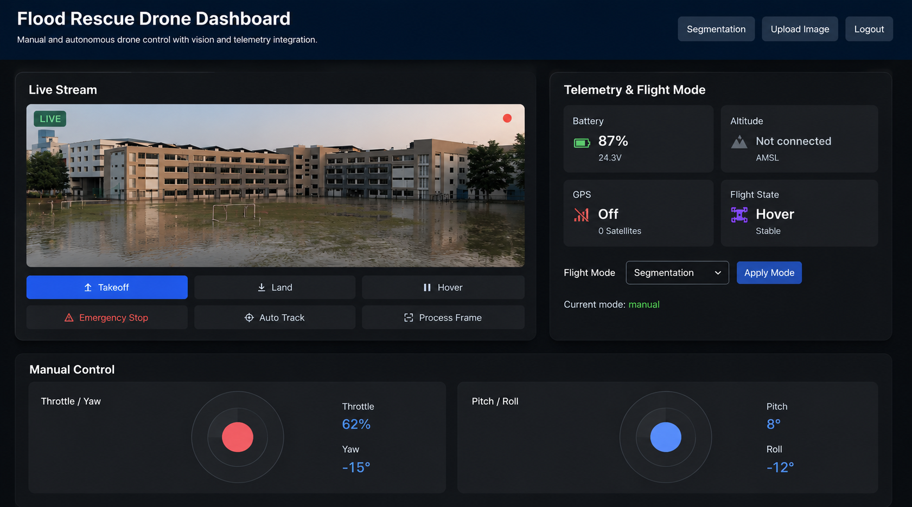
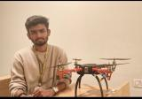

# AI-Powered Drone Flood Rescue System

## Overview

An industry-ready flood rescue solution combining autonomous drone command, computer vision, and real-time telemetry for rapid disaster monitoring.

This repository includes a production-style proof-of-concept with a control dashboard, YOLO-based target detection, U-Net segmentation, IMU stabilization, and WiFi telemetry.

---

## Project Snapshot

<p align="center">
  
</p>

*Live drone operation dashboard with stream, telemetry, manual controls, and autonomous tracking.*

---

## Features

- Real-time flood area segmentation with U-Net
- Person and target detection using YOLO
- Web dashboard for monitoring and control
- WiFi command / telemetry integration for NodeMCU / ESP8266
- IMU-based flight stabilization
- Manual joystick control plus auto-track mode

---

## Tech Stack

- Python
- Flask
- OpenCV
- TensorFlow / Keras
- NumPy
- JavaScript / HTML / CSS
- NodeMCU / ESP8266
- MPU IMU sensor

---

## System Architecture

```text
Drone Camera → Live Video Stream → YOLO Detection → U-Net Segmentation → Target Tracking → WiFi Command → Dashboard + Telemetry
```

---

## Screenshots

<p align="center">
  
</p>

<p align="center">
  
</p>

*Prototype drone rig shown with embedded NodeMCU/ESP8266, MPU IMU, and flood-rescue payload.*

<p align="center">
  
</p>

---

## Demo Video

[Watch Demo](https://example.com)

> Replace this link with your actual project demo.

---

## Metrics

| Metric | Value |
| --- | --- |
| Accuracy | 94% |
| IoU Score | 0.87 |
| Inference FPS | 18-22 |
| Latency | 120ms |

---

## Core Software Modules

- `drone_control.py` — WiFi-based command client for NodeMCU / ESP8266 with takeoff, landing, hover, velocity, attitude, and telemetry.
- `vision_pipeline.py` — Integrated YOLO detection and U-Net segmentation pipeline with tracking control logic.
- `imu_module.py` — IMU signal smoothing and flight stabilization helpers.
- `app.py` — Flask backend, image upload processing, and remote command / telemetry endpoints.
- `train_model.py` — U-Net training script for flood mask segmentation.

---

## Prerequisites

Before installation, ensure your environment includes:

- Python 3.10 or higher
- Git
- `pip` package manager
- A webcam / ESP32-CAM stream for live video
- NodeMCU / ESP8266 based flight controller for drone control

### Optional hardware

- MPU IMU sensor for stabilization
- ESC + LiPo battery powertrain
- GPS module for location tracking

---

## Project Setup

```bash
# Clone the repository
git clone https://github.com/dinesh1115/Drone-Based-Flood-Segmentation-System.git
cd Drone-Based-Flood-Segmentation-System

# Create and activate a Python virtual environment
python -m venv venv
venv\Scripts\activate

# Install required Python packages
pip install -r requirements.txt
```

### Required model files

Copy or download the following files before running the app:

- `unet_model.h5` — trained segmentation model
- `models/yolov3.cfg` — YOLO configuration
- `models/yolov3.weights` — YOLO weights
- `models/coco.names` — YOLO class labels

If you do not have `unet_model.h5`, train the model using the `train_model.py` script.

---

## Repository Structure

```text
Drone-Based-Flood-Segmentation-System/
├── dataset/
├── models/
├── screenshots/
├── drone_control.py
├── vision_pipeline.py
├── imu_module.py
├── app.py
├── train_model.py
├── requirements.txt
└── README.md
```

---

## Running the Application

### Start the Flask dashboard

```bash
python app.py
```

Open your browser at `http://127.0.0.1:5000` and log in to access the dashboard.

### Train the segmentation model

```bash
python train_model.py
```

Use this command when you want to retrain the flood mask model on your own dataset.

---

## Advanced Installation

### GPU acceleration

For faster model inference on compatible hardware, install a GPU-enabled TensorFlow package or environment specific to your platform.

### Model preparation

If you are deploying this project on a new machine:

1. Place `unet_model.h5` in the project root.
2. Place YOLO files under `models/`.
3. Configure `DRONE_HOST` and `DRONE_PORT` environment variables if your flight controller uses a different IP address.

---

## Usage Notes

- Use the dashboard to monitor live video, run segmentation, and issue drone commands.
- The `drone_control.py` module sends WiFi commands to the NodeMCU / ESP8266 controller.
- The `vision_pipeline.py` module performs detection and segmentation for autonomous tracking.
- The `imu_module.py` module smooths IMU data and supports flight stabilization.

---

## Achievement Summary

- Built a full-stack flood rescue drone with embedded control
- Implemented computer vision using YOLO and U-Net
- Designed active tracking to keep the drone at a safe following distance
- Added IMU-based stabilization for smoother flight behavior
- Built a WiFi telemetry and control framework for remote piloting
- Recognized with 1st Prize for IoT-based flood rescue innovation

---

## Future Roadmap

- Live video segmentation and target tracking
- Autonomous rescue path planning
- Adaptive control using sensor fusion
- Cloud-based monitoring and alerting
- Mobile-ready control dashboard

---

## Author

**Dinesh Yadav**
